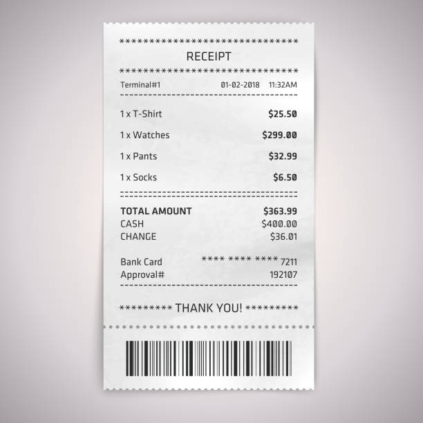

# OCR & QA System

## Overview
This project combines Optical Character Recognition (OCR) and Question Answering (QA) capabilities to extract text from images (bills) and answer user queries based on the extracted content. The system utilizes:
- **EasyOCR** for text extraction from images.
- **FAISS** for efficient document embedding and retrieval.
- **Hugging Face Transformers** for natural language processing.
- **Streamlit** for a user-friendly web interface.

## Features
- Upload an image (PNG, JPG, JPEG) and extract text automatically.
- Store extracted text in a FAISS vector database for efficient retrieval.
- Ask questions related to the extracted text and get meaningful answers.

## Installation
Ensure you have Python installed, then run the following command to install dependencies:
```bash
pip install -r requirements.txt
```

## Usage
Run the Streamlit UI:
```bash
streamlit run streamlit_ui.py
```

## File Structure
```
📂 simple-OCR-QA-bill-summarize
│── ocr_engine.py          # Handles text extraction from images using EasyOCR
│── embedding_search.py    # Creates FAISS embeddings for efficient search
│── qa_module.py           # Implements the QA system with a language model
│── streamlit_ui.py        # Provides a web interface for the system
│── requirements.txt       # Lists required dependencies
└── README.md              # Project documentation
```

## Dependencies
- `streamlit`
- `opencv-python`
- `easyocr`
- `langchain`
- `faiss-cpu`
- `transformers`

## Demo
For example, i have this bill for my shopping:

When i drag the file to the app, it generates texts based on the bill like this:

If i want to ask something about the bill, it will be like this:


## Contact
If you have any questions, feel free to contact me at [dinhvuha2003@gmail.com](mailto:dinhvuha2003@gmail.com).


